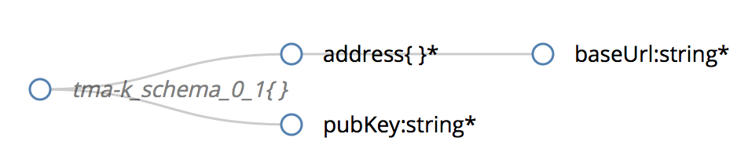
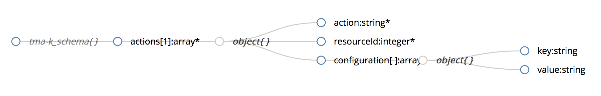

# Knowledge Component @ TMA Framework

The `TMA_Knowledge` component stores measurements data, and stores and manages information about the application architecture, resources and assets available and their possible adaptations.

The star schema envisaged for the ATMOSPHERE TMA framework is shown below. The fact table `Data` contains the basic numerical facts obtained from the readouts collected by the probes and the dimensions include all the different perspectives needed to characterize those numerical facts. 

The dimensions are as follows: 

* `resource` -- describes the resources and assets that constitute the deployed system and may include further information)
* `probe` -- stores information about all the probes in the system
* `description` -- refers to the types of measurements/events collected (e.g. execution time, memory allocated, CPU in use, response time) and constitutes the monitoring system vocabulary
* `time` -- describes the moment when each observation was collected

Each row on the fact table is linked to one (and only one) row in each dimension.

## Registration of Actuators

The `TMA_Knowledge` component provides an interface to the administrator of the system to add a new actuator. It will allow the TMA Framework to know which actuators can actuate on the system. Additionally, the administrator can also register all the possible actions through a different interface.

Initially, the administrator has to generate a public key to each actuator that will be used to authenticate when performing the adaptation operations. This has to be done only once, and it will be used to TMA to interact with the system.

Each administrator also needs to register each actuator through an authentication synchronous message, in which he/she will receive both the credentials and the public key. All communication is performed over REST services. 

The administrator needs to register all actions that can be performed by an actuator. This will allow TMA to decide what to do based on the list of available operations.

### Message Format for Actuator Registration

The message to be submitted to the `TMA_Knowledge` follow the `JSON` schema specified in [tma-k_schema](interface/atmosphere_tma-k_schema.json), which is currently in the version `0.1`. This should be used to notify TMA about the existence of the Actuator.

The figure below presents a representation of this schema, which is also explained below.

*Format of the data to be provided to the knowledge component.*

Each message includes:

* `address` -- an objet with the information about the ActuatorAPI
	* `url` --- the URL of where the operations are available. All actions will be available through this URL, which will direct the actuation to the proper operation
* `PubKey` -- generated once by the ActuatorAPI

### Message Format for Actions Registration

Additional, the following message should be sent to `TMA_Knowledge` to store all the possible actions. It follows the `JSON` schema specified in [tma-k_schema-actions](interface/atmosphere_tma-k_schema-actions.json), which is currently in the version `0.2`.

The figure below presents a representation of this schema, which is also explained below.

*Format of the data to be provided to the knowledge component to add the actions.*

Each message includes:

* `actions` -- a list of actions provided by the Actuator
	* `action` -- name of the action to be performed. This will be used to inform the ActuatorAPI about which action to be performed
	* `resourceId` -- identifies the resource in which the adaptation can be performed
	* `configuration` -- list of expected attributes to execute the operation
		* `key` -- name of the configuration attribute
		* `value` -- value of the configuration attribute
