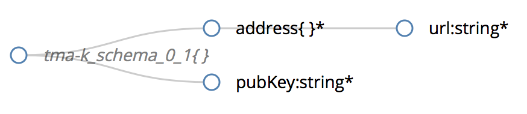

# Knowledge Component @ TMA Framework

The `TMA_Knowledge` component provides an interface to the administrator of the system to register a new actuator. It will allow the TMA Framework to know which actuators can actuate on the system. Additionally, the administrator can also register all the possible actions through a different interface.

Each administrator needs to register each actuator through an authentication synchronous message, in which he/she will receive both the credentials and the public key. All communication is performed over REST services. 

The administrator also needs to register all actions that can be performed by an actuator. This will allow TMA to decide what to do based on the list of available operations.

## TMA Knowledge Message Format

Format of the data to be provided to the knowledge component.
